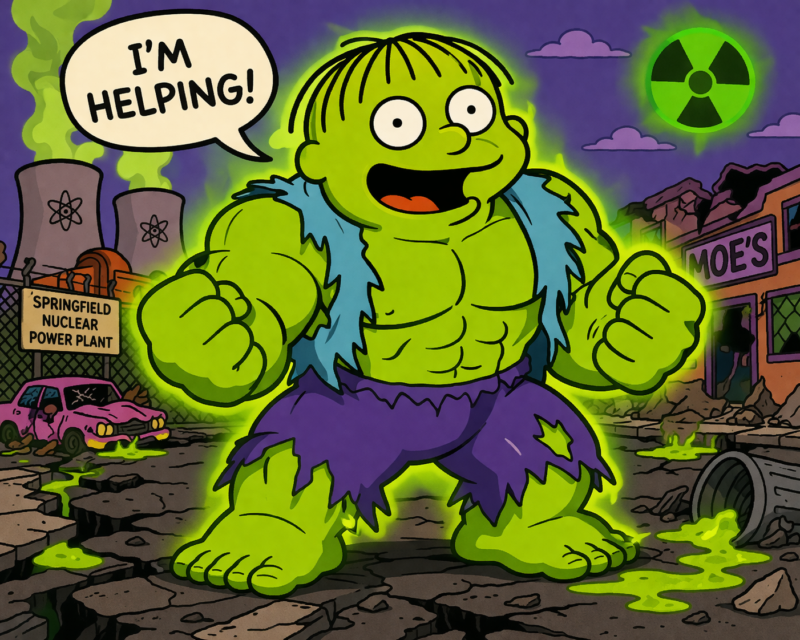

# radioactive-ralph

<p align="center">
  
</p>

> **"I'M HELPING!"** — Autonomous continuous development orchestrator for Claude Code.

[](https://pypi.org/project/radioactive-ralph/)
[](https://github.com/jbcom/radioactive-ralph/actions/workflows/ci.yml)
[](https://jbcom.github.io/radioactive-ralph/)

## What it is

radioactive-ralph is an external persistent daemon that drives Claude Code across a portfolio of GitHub repos — 24/7, without human intervention. It survives context resets, PR merges, process restarts, and API rate limits because it lives *outside* Claude's context window.

**The only time you should be engaged is to brainstorm the vision.**

## Quick start

```bash
# Run instantly — no install required
uvx radioactive-ralph run

# Or install permanently
pip install radioactive-ralph
ralph run
```

## How it works

```
┌─────────────────────────────────────────────────────┐
│                  radioactive-ralph                   │
│                   (Python daemon)                    │
│                                                      │
│  scan PRs → merge ready → review → address feedback  │
│       → discover work → spawn agents → loop          │
│                                                      │
│  State: ~/.radioactive-ralph/state.json              │
└──────────────┬──────────────────────────────────────┘
               │ spawns
               ▼
┌─────────────────────────────────────────────────────┐
│            claude CLI subprocesses                   │
│        (one per repo, run in parallel)               │
│                                                      │
│  Each agent: reads context, does work, opens PR      │
└─────────────────────────────────────────────────────┘
```

## Model tiering

| Task | Model |
|------|-------|
| Doc sweeps, frontmatter, bulk cleanup | `claude-haiku-4-5` |
| Feature work, bug fixes, PR review | `claude-sonnet-4-6` (default) |
| Architecture, security, vision | `claude-opus-4-6` |

## Configuration

Create `~/.radioactive-ralph/config.toml`:

```toml
[orgs]
arcade-cabinet = "~/src/arcade-cabinet"
jbcom = "~/src/jbcom"

bulk_model = "claude-haiku-4-5-20251001"
default_model = "claude-sonnet-4-6"
deep_model = "claude-opus-4-6"
max_parallel_agents = 5
```

Set `ANTHROPIC_API_KEY` in your environment.

## Commands

```bash
ralph run          # Start the daemon
ralph status       # Show current state
ralph discover     # Show discovered work items
ralph pr list      # List all open PRs with classification
ralph pr merge     # Merge all MERGE_READY PRs
ralph stop         # Stop the running daemon
```

## Requirements

- Python 3.12+
- `claude` CLI installed and authenticated (`claude login`)
- `gh` CLI installed and authenticated (`gh auth login`)
- `ANTHROPIC_API_KEY` set in environment

## Contributing

See [AGENTS.md](AGENTS.md) for agentic operating protocols and [STANDARDS.md](STANDARDS.md) for code quality rules.

```bash
git clone git@github.com:jbcom/radioactive-ralph.git
cd radioactive-ralph
uv sync --all-extras
uv run pytest
```
